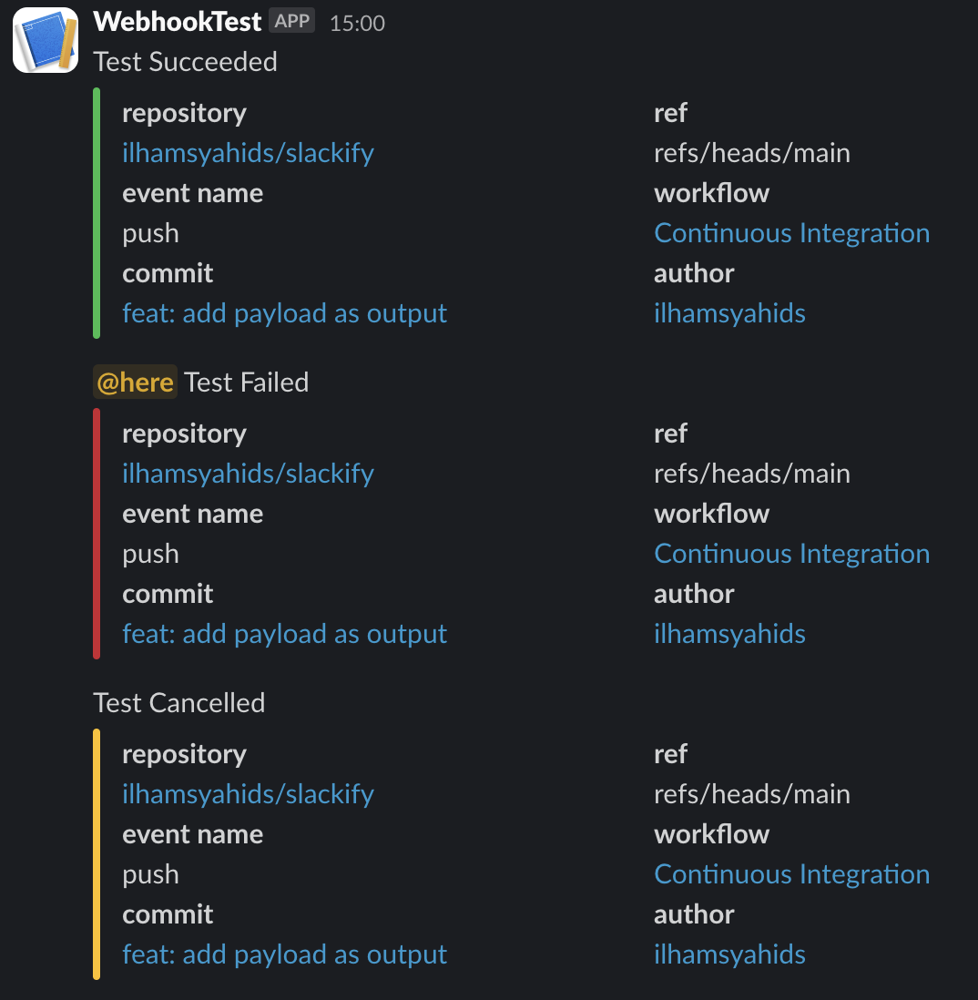

# Slacktify

[](https://github.com/super-linter/super-linter)

[](https://github.com/ilhamsyahids/slackify/actions/workflows/ci.yml)

[](https://github.com/marketplace/actions/slackify-notification?version=v1.1.0)
[](https://github.com/ilhamsyahids/slackify/releases)
[](https://codecov.io/gh/ilhamsyahids/slackify)


This is Slack Notification Action.

## Background

This repository is a fork of the original
[lazy-actions/slatify](https://github.com/lazy-actions/slatify) repository. The
original repository has not been updated for a long time (since 2021).
Therefore, we have decided to create new Action to ensure that the feature
remains available and up-to-date.

This new Action retains the core functionality of the original while
incorporating updated dependencies, fixing some issues, and implementing minor
adjustments to align with recent changes in the GitHub Actions environment, such
as
[this update](https://github.blog/changelog/2022-09-22-github-actions-all-actions-will-begin-running-on-node16-instead-of-node12/).

## Table of Contents

- [Slacktify](#slacktify)
  - [Background](#background)
  - [Table of Contents](#table-of-contents)
  - [Feature](#feature)
  - [Inputs](#inputs)
  - [Examples](#examples)
    - [Basic usage](#basic-usage)
    - [Mention if failure](#mention-if-failure)
    - [Includes commit information](#includes-commit-information)
    - [Legacy Information](#legacy-information)
    - [Override default token](#override-default-token)
  - [Slack UI](#slack-ui)
  - [LICENSE](#license)

## Feature

- Notify the result of GitHub Actions to Slack
- Support three job status (reference:
  [job-context](https://help.github.com/en/articles/contexts-and-expression-syntax-for-github-actions#job-context))
  - `success`
  - `failure`
  - `cancelled`
- Mention
  - Notify message to channel members efficiently
  - You can specify the condition to mention

## Inputs

You need to set input `with` with the following parameters:

| `with` parameter | required/optional | default                                  | description                                                                                                                                                                |
| :--------------: | :---------------: | :--------------------------------------- | :------------------------------------------------------------------------------------------------------------------------------------------------------------------------- |
|       type       |     required      | N/A                                      | The result of GitHub Actions job<br>This parameter value must contain the following word:<br>- `success`<br>- `failure`<br>- `cancelled`<br>Recommend: `${{ job.status }}` |
|     job_name     |     required      | N/A                                      | Slack notification title                                                                                                                                                   |
|       url        |     required      | N/A                                      | Slack Incoming Webhooks URL                                                                                                                                                |
|     mention      |     optional      | N/A                                      | Slack message mention                                                                                                                                                      |
|    mention_if    |     optional      | N/A                                      | The condition to mention<br>This parameter can contain the following word:<br>- `always`<br>- `success`<br>- `failure`<br>- `cancelled`                                    |
|    icon_emoji    |     optional      | Use Slack Incoming Webhook configuration | Legacy Information Slack icon                                                                                                                                              |
|     username     |     optional      | Use Slack Incoming Webhook configuration | Legacy Information Slack username                                                                                                                                          |
|     channel      |     optional      | Use Slack Incoming Webhook configuration | Legacy Information Slack channel name                                                                                                                                      |
|      commit      |     optional      | false                                    | If true, slack notification includes the latest commit message and author.                                                                                                 |
|      token       |     optional      | `${{ github.token }}`                    | This token is used to get commit data.                                                                                                                                     |

Please refer to [action.yml](./action.yml) for more details.

## Examples

### Basic usage

```yaml
- name: Slack Notification
  uses: ilhamsyahids/slackify@v1.1.0
  if: always()
  with:
    type: ${{ job.status }}
    job_name: '*Test*'
    url: ${{ secrets.SLACK_WEBHOOK }}
```

### Mention if failure

```yaml
- name: Slack Notification
  uses: ilhamsyahids/slackify@v1.1.0
  if: always()
  with:
    type: ${{ job.status }}
    job_name: '*Lint Check*'
    mention: 'here'
    mention_if: 'failure' # Mention if job status is failure
    url: ${{ secrets.SLACK_WEBHOOK }}
```

### Includes commit information

```yaml
- name: Slack Notification
  uses: ilhamsyahids/slackify@v1.1.0
  if: always()
  with:
    type: ${{ job.status }}
    job_name: '*Lint Check*'
    mention: 'here'
    mention_if: 'failure'
    url: ${{ secrets.SLACK_WEBHOOK }}
    commit: true # Include commit information
```

### Legacy Information

```yaml
- name: Slack Notification
  uses: ilhamsyahids/slackify@v1.1.0
  if: always()
  with:
    type: ${{ job.status }}
    job_name: '*Lint Check*'
    mention: 'here'
    mention_if: 'failure'
    icon_emoji: ':github:' # Slack icon
    username: 'GitHub Actions' # Slack username
    channel: '#general' # Slack channel
    url: ${{ secrets.SLACK_WEBHOOK }}
    commit: true
```

### Override default token

```yaml
- name: Slack Notification
  uses: ilhamsyahids/slackify@v1.1.0
  if: always()
  with:
    type: ${{ job.status }}
    job_name: '*Lint Check*'
    mention: 'here'
    mention_if: 'failure'
    url: ${{ secrets.SLACK_WEBHOOK }}
    commit: true
    token: ${{ secrets.PRIVATE_TOKEN }} # Override default token
```

## Slack UI



## LICENSE

[The MIT License (MIT)](https://github.com/ilhamsyahids/slackify/blob/master/LICENSE)
