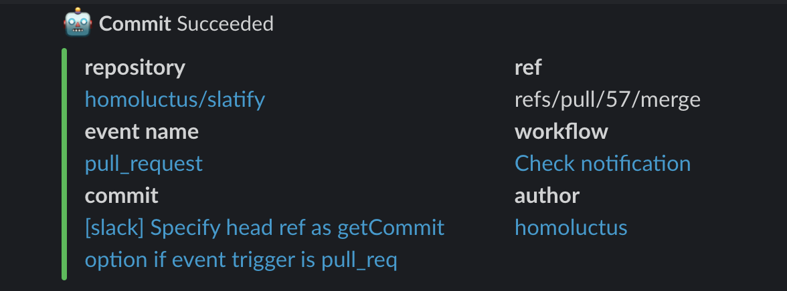
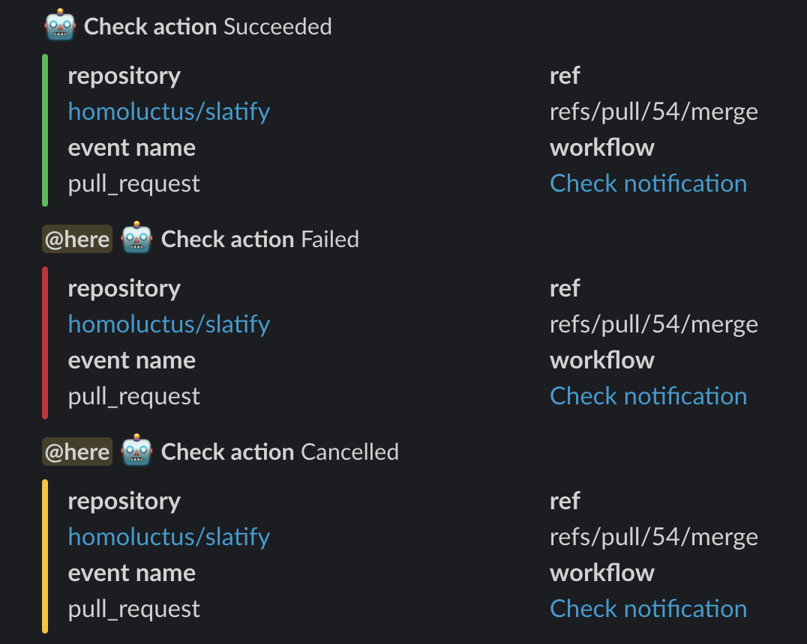

# Slacktify

This is Slack Notification Action.

## Disclaimer

We have observed that the Slack notification feature in our GitHub Action, which
conveys important messages such as repository name, commit, workflows and author
is highly beneficial. Consequently, we have decided to develop a new version of
[lazy-actions/slatify](https://github.com/lazy-actions/slatify), which has not
been maintained since 2021.

This new Action retains the core functionality of the original while
incorporating updated dependencies and implementing minor adjustments to align
with recent changes in the GitHub Actions environment, such as
[this update](https://github.blog/changelog/2022-09-22-github-actions-all-actions-will-begin-running-on-node16-instead-of-node12/).

## Table of Contents

- [Slacktify](#slacktify)
  - [Disclaimer](#disclaimer)
  - [Table of Contents](#table-of-contents)
  - [Feature](#feature)
  - [Inputs](#inputs)
  - [Examples](#examples)
    - [Basic usage](#basic-usage)
    - [Includes the latest commit information](#includes-the-latest-commit-information)
  - [Slack UI](#slack-ui)
  - [LICENSE](#license)

## Feature

- Notify the result of GitHub Actions
- Support three job status (reference:
  [job-context](https://help.github.com/en/articles/contexts-and-expression-syntax-for-github-actions#job-context))
  - `success`
  - `failure`
  - `cancelled`
- Mention
  - Notify message to channel members efficiently
  - You can specify the condition to mention

## Inputs

First of all, you need to set GitHub secrets for `SLACK_WEBHOOK` that is
Incoming Webhook URL.

You can customize the following parameters:

| `with` parameter | required/optional | default                                  | description                                                                                                                                                                        |
| :--------------: | :---------------: | :--------------------------------------- | :--------------------------------------------------------------------------------------------------------------------------------------------------------------------------------- |
|       type       |     required      | N/A                                      | The result of GitHub Actions job<br>This parameter value must contain the following word:<br>- `success`<br>- `failure`<br>- `cancelled`<br>We recommend using `${{ job.status }}` |
|     job_name     |     required      | N/A                                      | Means slack notification title                                                                                                                                                     |
|       url        |     required      | N/A                                      | Slack Incoming Webhooks URL<br>Please specify this key or `SLACK_WEBHOOK` environment variable<br>`SLACK_WEBHOOK` will be deprecated                                               |
|     mention      |     optional      | N/A                                      | Slack message mention                                                                                                                                                              |
|    mention_if    |     optional      | N/A                                      | The condition to mention<br>This parameter can contain the following word:<br>- `always`<br>- `success`<br>- `failure`<br>- `cancelled`                                            |
|    icon_emoji    |     optional      | Use Slack Incoming Webhook configuration | Legacy Information Slack icon                                                                                                                                                      |
|     username     |     optional      | Use Slack Incoming Webhook configuration | Legacy Information Slack username                                                                                                                                                  |
|     channel      |     optional      | Use Slack Incoming Webhook configuration | Legacy Information Slack channel name                                                                                                                                              |
|      commit      |     optional      | false                                    | If true, slack notification includes the latest commit message and author.                                                                                                         |
|      token       |   case by case    | N/A                                      | This token is used to get commit data.<br>If commit parameter is true, this parameter is required.<br>`${{ secrets.GITHUB_TOKEN }}` is recommended.                                |

Please refer to [action.yml](./action.yml) for more details.

## Examples

### Basic usage

```yaml
- name: Slack Notification
  uses: lazy-actions/slatify@master
  if: always()
  with:
    type: ${{ job.status }}
    job_name: '*Test*'
    channel: '#random'
    url: ${{ secrets.SLACK_WEBHOOK }}
```

### Includes the latest commit information

```yaml
- name: Slack Notification
  uses: lazy-actions/slatify@master
  if: always()
  with:
    type: ${{ job.status }}
    job_name: '*Lint Check*'
    mention: 'here'
    mention_if: 'failure'
    channel: '#random'
    url: ${{ secrets.SLACK_WEBHOOK }}
    commit: true
    token: ${{ secrets.GITHUB_TOKEN }}
```

## Slack UI




## LICENSE

[The MIT License (MIT)](https://github.com/ilhamsyahids/slackify/blob/master/LICENSE)
